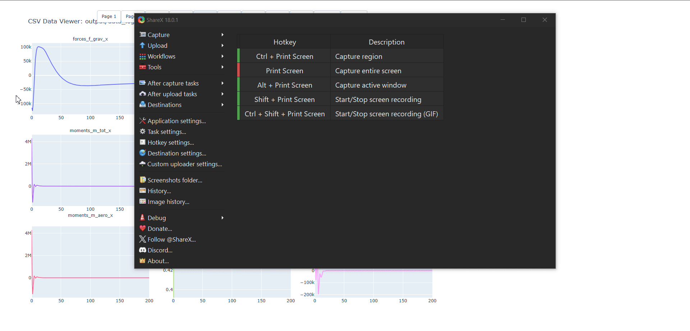

<p align="center">
  
</p>

# FlightLab – Virtual Aviation Environment  

A modular aerospace simulation platform for aircraft dynamics, control algorithms, and flight visualization.  Written in C.

## 📋 Features

| Feature | Description |
| :--- | :--- |
| **6-DOF** | High fidelity 6DOF flight dynamics |
| **Control System** | Cascaded PID control system with trim solving and linearization |
| **Sensor Simulation** | Sensor suite simulation for testing estimators and control systems robustness |
| **Aerodynamics** | Modular nonlinear aerodynamic databases that can be easily swapped for different models |
| **Monte Carlo** | Monte Carlo simulation for robustness and uncertainty analysis |
| **Environment** | Wind, gusts, and atmospheric modeling |
| **Modular** | Modular C-based core supporting easy development of new modules, models, and aircraft types |
| **Data** | Automatic data logging & plotting using custom plotting software |
| **Visualization** | Integration with FlightGear for 3D visualization and recording |
| **Development Platform** | Platform for developing advanced GNC algorithms (Kalman Filters, nonlinear/ ML control systems, etc.) |
| **Clean** | Clean project structure for easy development |


## 📊 Example Output

- Complete simulation data log timeseries (statevector, aerodynamic forces and coefficients, Xdot, etc.)
- Actuator and sensor output logs (servo positions, IMU readings, magnetometer, GPS, etc.)
- User custom algorithm logs (estimators, control systems, guidance systems)
- Interactive timeseries plots in custom plotting software
- Flightgear 3D animation of flight 
- Flight trajectory/ guidance visualization  

<p align="center">
  
</p>


## ⚡ Quick Start

```bash
# Clone repo
git clone https://github.com/maxschlussel/FlightLab.git
cd FlightLab

# Install required Python packages (venv recommended)
pip install -r requirements.txt

# Build, run, and plot results
make build run
```

... Or chose a config from the provided examples:

```bash
# Build project
make build

# Run simulation
build/flightlab.exe --data_log output/data_log.csv --config examples/basic_aricraft.json

# Plot results
python scripts/run_post_proc.py --data_log output/data_log.csv --plot_csv --simple_rot_vis
```

** The automatic make script assumes the python interpreter is in the virtual environment ".venv/Scripts/python.exe". If you environment path is different, update the path in the Makefile script to your python interpreter.

## 🔄 Simulation Flow  

1. **Initialization**  
   - Load all models, aircraft parameters, initial conditions, etc.
   - Initialize sensors, actuators, estimators, control systems, etc.

2. **Main Loop** (per time step `dt`)  
```c
while(simTime_s < tFinal_s){
    // [1] Read sensors
    readSensors(sensorInput, sensors);

    // [2] State estimation
    EKF_estimateState(ekf, sensors);

    // [3] Guidance references
    updateGuidanceRefs(guidanceRefs);

    // [4] Compute and actuate flight controls
    computeFlightControlCmd(X_est, guidanceRefs, controlSystem);
    
    driveActuators(controlSystem.cmd, actuators);

    // [5] Compute state derivative from EOM
    computeStateDerivative(X, actuators, Xdot);

    // [6] Log step
    loggerLogStep(simTime_s);

    // [7] Integrate and step forward
    RK4_integrateStep(X, Xdot, dt_s);

    simTime_s += dt_s;
}
```

3. **Post-Processing**  
   - Results stored in `output/data_log.csv`  
   - Python plotting scripts visualize important timeseries parameters  


## 📂 Project Structure  
```
FlighLab/
├─ src/                         # All code (headers colocated with sources)
│  ├─ core/                     # Core data structures/ types / parameters used everywhere
│  │  ├─ state_vector.h/.c      # StateVector (u,v,w,p,q,r,φ,θ,ψ,x,y,z), helpers
│  │  ├─ control_vector.h/.c    # ControlVector (δa,δe,δr, throttles), limits, mapping
│  │  ├─ constants.h/.c         # Physical constants, sim constants (G, R, rho0, eps)
│  │  ├─ aircraft_params.h/.c   # Struct of mass/inertia/geometry/refs (public)
│  │  └─ config.h/.c            # Run config: dt, sim length, feature flags
│  │
│  ├─ math/                     # Small, dependency-free math utilities
│  │  ├─ vec3.h/.c              # add, sub, dot, cross, scale, norm, normalize
│  │  ├─ mat3.h/.c              # 3x3 ops: mul, transpose, det, inverse
│  │  ├─ quat.h/.c              # quaternions (if/when you add them)
│  │  ├─ dcm.h/.c               # Euler↔DCM, body↔NED, wind↔body, etc.
│  │  ├─ stats.h/.c             # clamp, saturate, lerp, deadband, moving avg
│  │  └─ utils.h/.c             # deg↔rad, sign, safe_atan2, eps, numeric guards
│  │
│  ├─ dynamics/                 # Flight dynamics “physics”
│  │  ├─ kinematics/            # Rates/angles/positions transforms
│  │  │  ├─ eom.h/.c            # computeStateDerivative(...) 6-DOF core
│  │  │  ├─ airdata.h/.c        # computeAlphaBetaTasQinf(...), Mach, Re, TAS→CAS
│  │  │  └─ frames.h/.c         # body↔inertial↔stability↔wind transforms
│  │  ├─ environment/           # Atmosphere & environment models
│  │  │  ├─ isa.h/.c            # ISA/US Standard Atmosphere, density/pressure/T
│  │  │  ├─ wind.h/.c           # steady wind, turbulence models (Dryden, von Karman)
│  │  │  └─ gravity.h/.c        # gravity model (WGS-84/NED), body projection
│  │  ├─ forces/                # Force contributors
│  │  │  ├─ aero.h/.c           # computeAerodynamicLoads(...) (F_aero,M_aero)
│  │  │  ├─ propulsion.h/.c     # thrust models, engine/prop torque, moments
│  │  │  ├─ landing_gear.h/.c   # ground reaction, friction, steering
│  │  │  └─ miscellaneous.h/.c  # tail strike, parasite forces, etc (optional)
│  │  ├─ massprops/             # Mass properties & CG management
│  │  │  ├─ inertia.h/.c        # inertia tensor build, parallel-axis, updates
│  │  │  └─ cg.h/.c             # cg position, fuel shift, payload ops
│  │  └─ integrators/           # Time integration schemes
│  │     ├─ euler.h/.c          # integrateEulerStep(...)
│  │     ├─ rk4.h/.c            # integrateRK4(...)
│  │     └─ semi_implicit.h/.c  # symplectic/semi-implicit Euler (optional)
│  │
│  ├─ systems/                  # Higher-level aircraft/system models
│  │  ├─ aero_model/            # Coefficient maps, lookup, blending
│  │  │  ├─ c172_coeffs.h/.c    # polars, derivatives for C172
│  │  │  ├─ flaps_model.h/.c    # flap effects on CL/CD/CM, drag buckets
│  │  │  └─ ground_effect.h/.c  # near-ground lift/drag mods
│  │  ├─ propulsion_model/
│  │  │  ├─ fixed_pitch.h/.c    # fixed-pitch prop model
│  │  │  └─ engine_map.h/.c     # engine torque map vs RPM, throttle
│  │  └─ controls_model/
│  │     ├─ mixer.h/.c          # control input mixing, trims, limits
│  │     └─ actuator.h/.c       # actuator rate limits, lags
│  │
│  ├─ io/                       # Input/output & utilities
│  │  ├─ logger.h/.c            # CSV/TSV logger, rotating files, headers
│  │  ├─ telemetry.h/.c         # optional runtime stream (UDP/serial)
│  │  └─ cli.h/.c               # parse args, config files
│  │
│  ├─ sim/                      # Simulation “orchestration”
│  │  ├─ main.c                 # main(), run loop, wiring modules
│  │  ├─ loop.h/.c              # stepSim(...): read→forces→integrate→log
│  │  └─ scenarios.h/.c         # scenario setups (trim, climb, turn, etc.)
│  │
│  ├─ controllers               # Autopilot/RL controllers
│  ├─ actuators                 # Servo models, propulsion actuators
│  ├─ sensors                   # Sensors, filters (INS, complementary/KF), estimators
│  └─ tests/                    # Unit tests (if adding)
│
├─ output/                      # Runtime results: CSV logs, plots, data
│  ├─ logs/
│  ├─ plots/
│  └─ data/
├─ scripts/                     # Post-processing Python/Matlab
├─ build/                       # Build artifacts (obj/bin separated if you like)
├─ Makefile
└─ README.md

```

---

## 🗺️ Roadmap  

- [x] Implement fundamental 6DOF dynamic EOM
- [x] Implement simple Euler state integrator model
- [x] Create core data structures (StateVectos, ControlVector, Vec3, AircraftParams, etc.)
- [x] Implement basic aircraft model (aerodynamics parameters and coefficient equations)
- [x] Add control surface modeling  
- [x] Develop basic actuator and sensor models
- [x] Implement RK4 integration model
- [x] Implement quaternions
- [x] Develop robust data logging pipeline and plotting toolset
- [x] Connect with FlightGear for 3D visualization
- [X] Develop complementary filter state estimator
- [X] Develop Extended Kalmon filter state estimator
- [X] Implement trim solver/ linearization
- [ ] Design cascaded PID control system
- [ ] Develop guidance algorithms
- [ ] Implement wind, gusts, and atmospheric modeling
- [ ] Monte-Carlo simulation for robustness studies  
- [ ] Real-time simulator mode  
- [ ] Expand aircraft database  
- [ ] Develop advanced GNC algorithms (nonlinear control, ML control, etc.)
- [ ] Increase fidelity (arodynamics, sensors, environment, mass, etc.)
